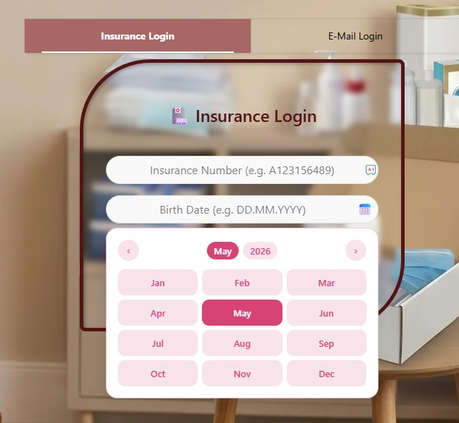
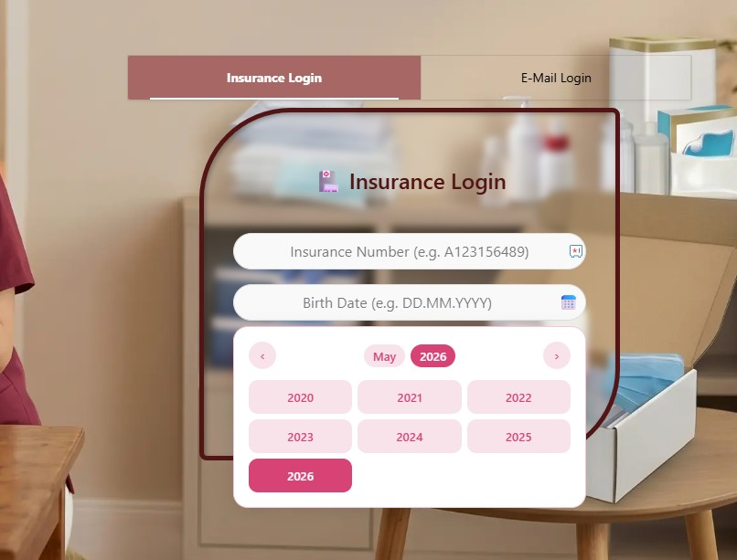

# 📅 APEX Smart Datepicker Plugin

> A smart, lightweight Oracle APEX Date Picker plugin focused on UX, validation, and fast date selection.  
> Built with ❤️ by [Sajjad Hanifa](https://shsoftwaresolution.com) · S&H Software Solutions

---


---

## ✨ Features

- **Fast year & month selection** — no endless scrolling, click directly on year or month
- **Auto-format on typing** — user types `04021985`, gets `04.02.1985` automatically
- **Min / Max date support** — supports `SYSDATE`, `SYSDATE+30`, `SYSDATE-365` or fixed dates like `01.01.1920`
- **Live validation** — red border if manually typed date is out of range
- **Disabled dates** — grayed out with `not-allowed` cursor for out-of-range days
- **Calendar icon** — opens the picker, field stays typeable
- **Auto language detection** — German or English based on browser language
- **Custom primary color** — all shades calculated automatically from one hex color
- **Fully responsive** — adapts to APEX item width with or without stretch
- **No overflow clipping** — picker renders outside any APEX region boundary
- **No external libraries** — pure JavaScript and CSS, no dependencies

---

## 🖼️ Screenshots

| Default | Days |
|---|---|
|  |  |

| Months | Years |
|---|---|
|  |  |

---

## 🎬 Demo Video

👉 [Watch full demo video](demo/apex_smart_datepicker_demo.mp4)

---

## 📁 Repository Structure

```
apex-smart-datepicker/
├── plugin/
│   └── we_datepicker.sql              ← APEX Plugin export (import this)
├── src/
│   ├── we_datepicker.js               ← JavaScript logic
│   ├── we_datepicker.css              ← Styles
│   └── render_date_picker.sql         ← PL/SQL render procedure
├── screenshots/
│   ├── apex_smart_datepicker.jpg
│   ├── apex_smart_datepicker_days.jpg
│   ├── apex_smart_datepicker_months.jpg
│   └── apex_smart_datepicker_years.jpg
├── demo/
│   ├── apex_smart_datepicker_demo.gif
│   └── apex_smart_datepicker_demo.mp4
└── README.md
```

---

## 🚀 Installation

1. Go to **Shared Components → Plug-ins → Import**
2. Import the file from the `plugin/` folder
3. Upload `we_datepicker.js` and `we_datepicker.css` under the **Files** tab
4. Set **Render Procedure** to `RENDER_DATE_PICKER`
5. Paste the PL/SQL code from `src/render_date_picker.sql` into the **Source** tab

---

## 🧩 Usage

1. Add a new item to your APEX page
2. Select **Date Picker WE** as the item type
3. Configure placeholder, color, and min/max dates in the item settings
4. Save and run

---

## ⚙️ Plugin Attributes

| # | Label | Type | Description |
|---|---|---|---|
| 1 | Text Alignment | Select List | `left`, `center`, `right` |
| 2 | Primary Color | Text | Hex color e.g. `#7b1a2e` |
| 3 | Min Date | Text | See allowed values below |
| 4 | Max Date | Text | See allowed values below |

### Min / Max Date — Allowed Values

| Value | Result |
|---|---|
| *(empty)* | No limit |
| `SYSDATE` | Today |
| `SYSDATE+30` | Today + 30 days |
| `SYSDATE-365` | Today − 365 days |
| `01.01.1920` | Fixed date (DD.MM.YYYY) |

---

## 🌍 Language Support

| Browser Language | Result |
|---|---|
| `de` | German month and day names |
| anything else | English |

---

## 🎨 Color Customization

Set one hex color as **Primary Color** — the plugin automatically calculates:

- Light background for hover states
- Medium tone for borders
- Full color for selected dates and active buttons

---

## 📋 Requirements

- Oracle APEX 22+
- No external libraries required
- Pure JavaScript and CSS

---

## 👨‍💻 Author

**Sajjad Hanifa** — Oracle ACE Apprentice · APEX Developer & Consultant

| | |
|---|---|
| 🌐 Website | [shsoftwaresolution.com](https://shsoftwaresolution.com) |
| 📝 Blog | [apexnote.de](https://apexnote.de) |
| ▶️ YouTube | [@APEX-NOTE](https://www.youtube.com/@APEX-NOTE) |
| 💼 LinkedIn | [sajjad-hanifa](https://www.linkedin.com/in/sajjad-hanifa/) |

> Built at **S&H Software Solutions** — advancing Oracle APEX development worldwide.

---

## 📄 License

MIT License — free to use, modify and distribute.  
Copyright (c) 2026 S&H Software Solutions